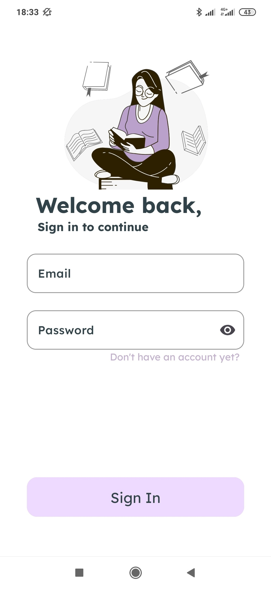
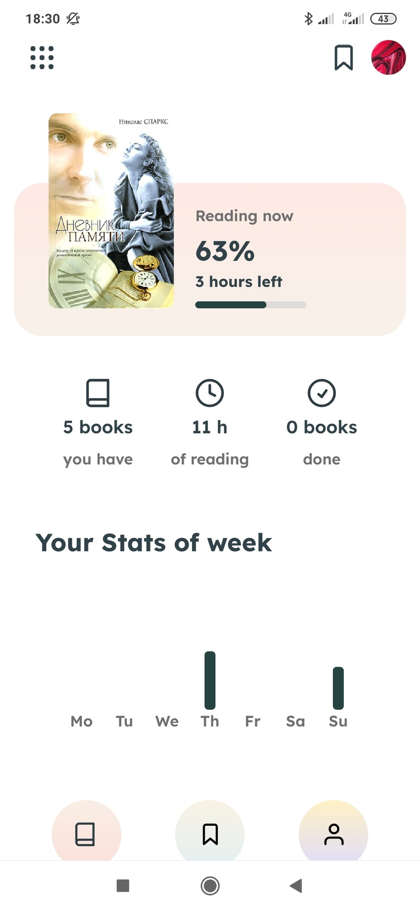
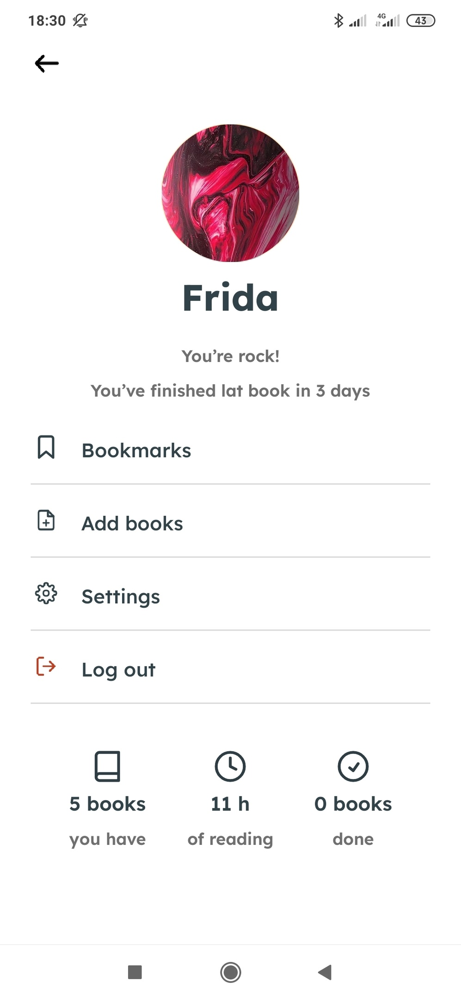
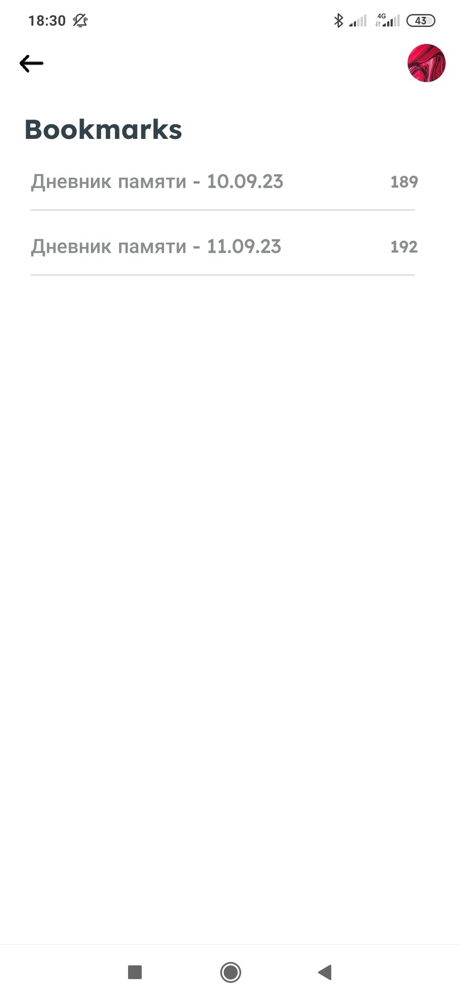
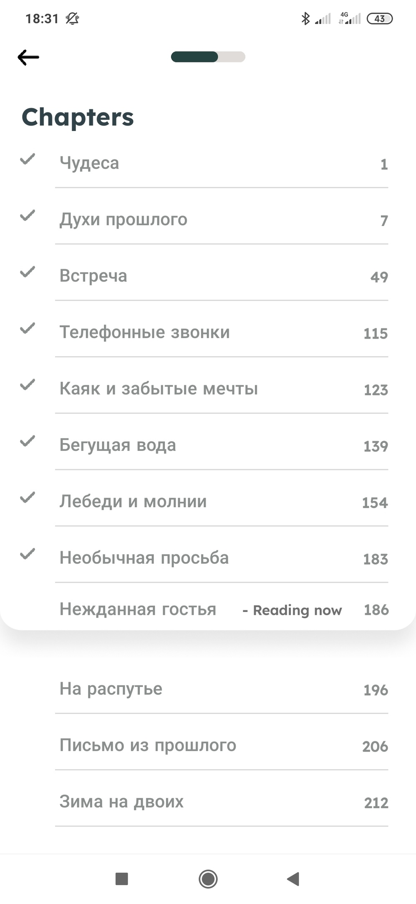

# BookShelf [MVVM,Dagger&Hilt,Room,GSON,Coroutines]

The application allows you to read books in fb2 format, make bookmarks and track your statistics.

## Screenshots
Screenshot of each activity

</img>

</img>
</img>
</img>

</img>
</img>
</img>

## Structure

#### Model
The model is presented from the repository for authorization

#### View
View are classic activities
 
#### ViewModel
ViewModels contain the logic of their screens

## Hilt dependencies
Dependencies are declared in modules from the Dagger&Hilt
 - `DataModule`
